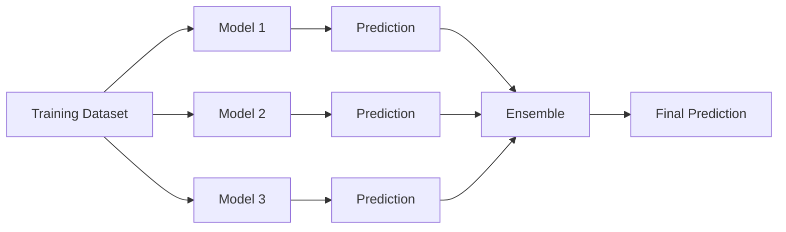
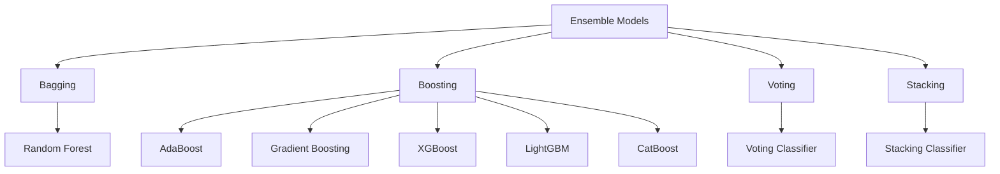

# Ensemble Models in Supervised Machine Learning

> A technical review of ensemble models in supervised Machine Learning, including Bagging, Boosting, Stacking, and widely used algorithms such as AdaBoost, XGBoost, LightGBM, CatBoost, Voting Classifier, and Stacking Classifier.

## Project Overview

Ensemble methods are among the most effective approaches in supervised Machine Learning. Instead of relying on a single predictive model, they combine the outputs of multiple learners to improve predictive accuracy, robustness, stability, and generalization.

This repository presents a structured review of the main ensemble strategies: **Bagging**, **Boosting**, and **Stacking**. It also examines the mechanisms, advantages, and common use cases of widely adopted algorithms, including AdaBoost, Gradient Boosting, XGBoost, LightGBM, CatBoost, Voting Classifier, and Stacking Classifier.

The document emphasizes practical applications in customer analytics, marketing, recommendation systems, demand forecasting, fraud detection, and predictive modeling. Every concept is supported by peer-reviewed scientific literature, seminal research papers, or official technical documentation.

# Table of Contents

1. Introduction
2. What is an Ensemble Model?
3. What is the Difference Between Bagging and Boosting?
4. What is Stacking?
5. Why Do Ensemble Models Generalize Better?
6. Ensemble Algorithms
7. Comparison of Ensemble Algorithms
8. Real-World Applications
9. Conclusion
10. References

# Introduction

Machine Learning has become one of the most influential fields of Artificial Intelligence, enabling computers to identify patterns, learn from historical data, and make predictions across a wide range of applications. Among the different approaches available, **ensemble models** have emerged as one of the most successful techniques for improving predictive performance in supervised learning tasks.

Rather than relying on a single model, ensemble methods combine the predictions of multiple individual learners to produce a more accurate and reliable final prediction. The underlying principle is that a group of diverse models can often outperform even the best individual model by reducing prediction errors and increasing robustness.

Over the past two decades, ensemble algorithms have consistently achieved state-of-the-art performance in academic competitions and real-world industrial applications. Models such as **Random Forest**, **XGBoost**, **LightGBM**, and **CatBoost** are widely used in domains including finance, healthcare, marketing, fraud detection, recommendation systems, customer analytics, and demand forecasting due to their ability to handle complex datasets while maintaining high predictive accuracy.

This document provides a structured overview of ensemble models in supervised Machine Learning. It explains the fundamental concepts of **Bagging**, **Boosting**, and **Stacking**, analyzes their differences, discusses the bias-variance tradeoff, and describes the mechanisms, advantages, and common applications of the most widely used ensemble algorithms. The objective is to provide both a theoretical foundation and a practical understanding of why ensemble methods have become a cornerstone of modern predictive modeling.

# 1. What is an Ensemble Model?

An **ensemble model** is a Machine Learning technique that combines the predictions of multiple individual models, known as **base learners** or **weak learners**, to produce a single, more accurate prediction. Instead of relying on the performance of a single algorithm, ensemble methods exploit the collective intelligence of several models, reducing prediction errors and improving overall performance.

The main objective of ensemble learning is to increase a model's ability to generalize to unseen data. By combining multiple predictors, ensemble models often achieve higher accuracy, greater robustness, and better stability than individual models. This improvement is possible because different models may capture different patterns within the same dataset, allowing the ensemble to compensate for the weaknesses of each individual learner.

Ensemble methods are particularly effective in supervised Machine Learning tasks such as classification and regression. They are widely applied in business environments where predictive accuracy is critical, including customer churn prediction, fraud detection, recommendation systems, demand forecasting, credit risk assessment, and marketing analytics.

The success of an ensemble depends on two key principles:

- **Accuracy:** each individual model should perform better than random guessing.
- **Diversity:** the models should make different types of errors, allowing the ensemble to correct individual mistakes through combination.

Several strategies exist for combining multiple models. The most common approaches are **Bagging**, **Boosting**, and **Stacking**, each using a different mechanism to generate and aggregate predictions. These strategies form the foundation of many of today's most successful Machine Learning algorithms, including Random Forest, XGBoost, LightGBM, and CatBoost.

# 2. What is the Difference Between Bagging and Boosting?

**Bagging (Bootstrap Aggregating)** and **Boosting** are two of the most widely used ensemble learning techniques. Although both combine multiple models to improve predictive performance, they differ significantly in how models are trained and how their predictions are combined.

### Bagging

Bagging builds multiple independent models by training each one on a different bootstrap sample (random samples with replacement) of the original dataset. Since every model learns independently, their predictions are typically combined through majority voting for classification or averaging for regression.

The primary objective of Bagging is to **reduce variance**, making the model more stable and less prone to overfitting.

**Characteristics**

- Models are trained independently.
- Training occurs in parallel.
- Each model uses a different bootstrap sample.
- Final predictions are aggregated through voting or averaging.
- Particularly effective for high-variance models such as decision trees.

**Example:** Random Forest.

### Boosting

Boosting trains models sequentially rather than independently. Each new model focuses on correcting the errors made by the previous models, gradually improving the overall predictive performance.

Instead of treating all observations equally, Boosting assigns greater importance to previously misclassified or poorly predicted instances, allowing the ensemble to learn progressively more difficult patterns.

The primary objective of Boosting is to **reduce bias** while maintaining good generalization performance.

**Characteristics**

- Models are trained sequentially.
- Each model learns from the errors of the previous one.
- More weight is assigned to difficult observations.
- Predictions are combined using weighted aggregation.
- Often achieves higher predictive accuracy but may require careful tuning to avoid overfitting.

**Examples:** AdaBoost, Gradient Boosting, XGBoost, LightGBM, and CatBoost.

### Comparison

| Feature | Bagging | Boosting |
|----------|----------|-----------|
| Training strategy | Parallel | Sequential |
| Main objective | Reduce variance | Reduce bias |
| Model dependency | Independent | Dependent |
| Data sampling | Bootstrap sampling | Reweighted observations or residual learning |
| Risk of overfitting | Lower | Higher if not properly regularized |
| Typical example | Random Forest | XGBoost |

# 3. What is Stacking?

**Stacking (Stacked Generalization)** is an ensemble learning technique that combines the predictions of multiple different models by introducing an additional model, called the **meta-learner**, responsible for producing the final prediction.

Unlike Bagging and Boosting, which typically combine models of the same family, Stacking allows completely different algorithms to work together. For example, a Decision Tree, Support Vector Machine, Logistic Regression, and Neural Network can all serve as base learners.

The process consists of two stages:

1. Multiple base models are trained using the original dataset.
2. Their predictions become the input features for a meta-model, which learns how to combine them to generate the final prediction.

Because different algorithms capture different characteristics of the data, the meta-learner can exploit their complementary strengths, often achieving better predictive performance than any individual model.

### Advantages

- Combines different Machine Learning algorithms.
- Exploits complementary strengths of multiple models.
- Often achieves higher predictive accuracy.
- Highly flexible and adaptable to different problems.

### Limitations

- More computationally expensive.
- More complex to implement.
- Requires careful validation to avoid data leakage and overfitting.

### Example

A marketing company predicting customer purchases may combine predictions from a Random Forest, XGBoost, and Logistic Regression model. A Logistic Regression meta-model then learns how to combine these predictions to produce a more accurate final estimate.

# 4. Why Do Ensemble Models Generalize Better?

One of the primary goals of Machine Learning is to build models that perform well not only on the training data but also on previously unseen data. This ability is known as **generalization**.

Ensemble models generally achieve better generalization because they reduce prediction errors associated with the **bias-variance tradeoff**.

- **Bias** represents errors caused by overly simplistic assumptions. Models with high bias tend to underfit the data.
- **Variance** represents errors caused by excessive sensitivity to the training data. Models with high variance tend to overfit.

Different ensemble strategies address these problems in different ways.

### Bagging

Bagging primarily reduces **variance** by averaging the predictions of multiple independently trained models. Individual errors tend to cancel each other out, producing a more stable predictor.

### Boosting

Boosting primarily reduces **bias** by sequentially correcting previous mistakes. Each model improves upon the weaknesses of its predecessors, allowing the ensemble to learn increasingly complex relationships.

### Stacking

Stacking improves generalization by combining models with different learning behaviors. Since each algorithm captures different patterns in the data, the meta-learner can exploit their complementary strengths to produce more reliable predictions.

As a result, ensemble methods often outperform individual models in terms of predictive accuracy, robustness, and stability, making them the preferred choice for many real-world supervised Machine Learning applications.

# 5. Ensemble Algorithms

Ensemble learning includes several algorithms that differ in the way they generate and combine multiple predictive models. This section reviews the most widely used ensemble algorithms, explaining their mechanisms, advantages, and common applications.

## 5.1 AdaBoost (Adaptive Boosting)

AdaBoost, short for **Adaptive Boosting**, was one of the first successful boosting algorithms and was introduced by Yoav Freund and Robert Schapire in 1997. It builds a strong classifier by sequentially combining multiple weak learners, typically shallow decision trees known as decision stumps.

### Mechanism

AdaBoost trains one weak learner at a time. After each iteration, the algorithm increases the weights of the training instances that were incorrectly classified, forcing the next learner to focus on the most difficult observations. At the end of the training process, each learner contributes to the final prediction according to its accuracy, with better-performing models receiving greater influence.

### Advantages

- Simple and relatively easy to implement.
- Often achieves higher accuracy than a single classifier.
- Reduces prediction bias by progressively correcting previous errors.
- Performs well on clean and moderately sized datasets.
- Can improve weak learners into a strong predictive model.

### Common Use Cases

- Customer churn prediction.
- Email spam detection.
- Credit approval systems.
- Marketing campaign response prediction.
- Binary classification problems with structured data.

## 5.2 Gradient Boosting

Gradient Boosting is a boosting technique that improves predictive performance by sequentially fitting new models to the residual errors made by previous models. Unlike AdaBoost, which adjusts sample weights, Gradient Boosting minimizes a differentiable loss function using gradient descent principles.

### Mechanism

The algorithm begins with an initial prediction. Each subsequent model is trained to predict the residual errors of the current ensemble. By iteratively reducing these errors, the ensemble gradually converges toward a more accurate prediction.

### Advantages

- High predictive accuracy.
- Flexible optimization through different loss functions.
- Applicable to both regression and classification.
- Captures complex nonlinear relationships.
- Provides feature importance estimates.

### Common Use Cases

- Sales forecasting.
- Customer lifetime value prediction.
- Insurance risk assessment.
- Demand forecasting.
- Financial forecasting.

## 5.3 XGBoost (Extreme Gradient Boosting)

XGBoost is an optimized implementation of Gradient Boosting designed for speed, scalability, and predictive performance. Developed by Tianqi Chen and Carlos Guestrin, it has become one of the most successful Machine Learning algorithms for structured tabular data.

### Mechanism

XGBoost extends traditional Gradient Boosting by incorporating regularization techniques, parallel tree construction, efficient handling of missing values, and optimized memory management. These improvements reduce overfitting while significantly accelerating model training.

### Advantages

- Excellent predictive accuracy.
- Fast and scalable training.
- Built-in regularization reduces overfitting.
- Handles missing values automatically.
- Supports parallel processing.
- Widely adopted in Machine Learning competitions.

### Common Use Cases

- Fraud detection.
- Credit scoring.
- Customer churn prediction.
- Recommendation systems.
- Demand forecasting.
- Marketing analytics.

## 5.4 LightGBM (Light Gradient Boosting Machine)

LightGBM is a gradient boosting framework developed by Microsoft that is specifically designed for efficiency and scalability. It uses histogram-based learning and a leaf-wise tree growth strategy, allowing it to train significantly faster than traditional Gradient Boosting algorithms while maintaining high predictive accuracy.

### Mechanism

Unlike many boosting algorithms that grow trees level by level, LightGBM expands the leaf that maximizes the reduction of the loss function. It also discretizes continuous features into histograms, reducing memory usage and accelerating training without substantially affecting performance.

### Advantages

- Very fast training and prediction.
- Low memory consumption.
- Excellent performance on large datasets.
- Supports parallel and distributed learning.
- Handles high-dimensional data efficiently.

### Common Use Cases

- Customer segmentation.
- Click-through rate prediction.
- Large-scale recommendation systems.
- Sales forecasting.
- Marketing analytics.

---

## 5.5 CatBoost (Categorical Boosting)

CatBoost is a gradient boosting algorithm developed by Yandex that is specifically designed to handle categorical variables efficiently. Unlike many Machine Learning algorithms, CatBoost can process categorical features directly without requiring extensive preprocessing such as one-hot encoding.

### Mechanism

CatBoost applies ordered boosting and specialized encoding techniques to transform categorical variables while minimizing prediction shift and overfitting. This enables the algorithm to learn effectively from datasets containing numerous categorical features.

### Advantages

- Native support for categorical variables.
- Minimal feature preprocessing.
- Strong resistance to overfitting.
- High predictive accuracy.
- Easy to use with mixed numerical and categorical datasets.

### Common Use Cases

- Customer behavior prediction.
- E-commerce recommendation systems.
- Credit risk assessment.
- Marketing response prediction.
- Customer lifetime value estimation.

---

## 5.6 Voting Classifier

A Voting Classifier is an ensemble method that combines the predictions of multiple independent classifiers. Rather than training models sequentially, it aggregates their predictions to produce a final decision.

### Mechanism

Each base classifier is trained independently using the same training dataset. During prediction, the outputs are combined using either:

- **Hard Voting:** the class receiving the majority of votes is selected.
- **Soft Voting:** predicted class probabilities are averaged, and the class with the highest average probability is selected.

### Advantages

- Simple to implement.
- Improves prediction stability.
- Reduces dependence on a single model.
- Can combine completely different algorithms.
- Often increases classification accuracy.

### Common Use Cases

- Medical diagnosis.
- Fraud detection.
- Email spam filtering.
- Customer classification.
- Credit approval.

---

## 5.7 Stacking Classifier

A Stacking Classifier is the practical implementation of the stacking strategy for classification problems. It combines the predictions of multiple base classifiers using a meta-classifier that learns how to optimally integrate their outputs.

### Mechanism

Several different classifiers are first trained independently. Their predictions become the input features of a meta-classifier, which learns the best way to combine them to produce the final prediction.

Unlike a Voting Classifier, where every model contributes equally or through predefined weights, the meta-classifier automatically learns the optimal combination from the training data.

### Advantages

- Often achieves state-of-the-art predictive performance.
- Combines complementary strengths of multiple algorithms.
- Highly flexible.
- Can reduce both bias and variance.
- Suitable for complex prediction problems.

### Common Use Cases

- Financial forecasting.
- Medical diagnosis.
- Customer churn prediction.
- Recommendation systems.
- Machine Learning competitions.

# 6. Comparison of Ensemble Algorithms

The following table summarizes the main characteristics of the ensemble algorithms discussed in this document. Although all of them improve predictive performance by combining multiple models, they differ in their learning strategies, strengths, and typical applications.

| Algorithm | Ensemble Strategy | Main Strength | Main Limitation | Typical Applications |
|------------|-------------------|---------------|-----------------|----------------------|
| **AdaBoost** | Boosting | Simple and effective for improving weak learners | Sensitive to noisy data and outliers | Spam detection, customer churn, binary classification |
| **Gradient Boosting** | Boosting | High predictive accuracy and flexible optimization | Slower training than more optimized implementations | Sales forecasting, financial prediction, insurance risk |
| **XGBoost** | Boosting | Excellent accuracy, regularization, and scalability | Requires hyperparameter tuning | Fraud detection, credit scoring, recommendation systems, marketing analytics |
| **LightGBM** | Boosting | Extremely fast training and low memory usage | May overfit on small datasets if not tuned properly | Large-scale analytics, click-through rate prediction, demand forecasting |
| **CatBoost** | Boosting | Native handling of categorical variables | Longer training time than LightGBM for some datasets | Customer behavior prediction, e-commerce, marketing response |
| **Voting Classifier** | Voting | Simple implementation and improved stability | Limited improvement when base models are highly correlated | Medical diagnosis, fraud detection, customer classification |
| **Stacking Classifier** | Stacking | Combines different algorithms to maximize predictive performance | Higher computational complexity and risk of overfitting | Recommendation systems, customer churn, financial forecasting |

## Key Differences

Although all ensemble algorithms combine multiple models, they address predictive problems in different ways:

- **AdaBoost** focuses on correcting misclassified observations by increasing their importance during training.
- **Gradient Boosting** minimizes prediction errors by fitting each new model to the residuals of the current ensemble.
- **XGBoost** extends Gradient Boosting with regularization, parallelization, and optimized tree construction, making it one of the most successful algorithms for structured data.
- **LightGBM** prioritizes computational efficiency and scalability through histogram-based learning and leaf-wise tree growth.
- **CatBoost** specializes in datasets containing categorical variables by processing them directly without extensive preprocessing.
- **Voting Classifier** aggregates the predictions of multiple independent models through hard or soft voting.
- **Stacking Classifier** learns how to combine the predictions of several models using a meta-classifier, often achieving the highest predictive performance among ensemble techniques.

# 7. Real-World Applications

Ensemble models are widely adopted across industries because they provide high predictive accuracy, robustness, and scalability. They are particularly effective when working with structured data, where they often outperform individual Machine Learning models.

The following examples illustrate some of the most common real-world applications of ensemble methods.

## Fraud Detection

Financial institutions use ensemble algorithms to detect fraudulent transactions by analyzing customer behavior, transaction history, spending patterns, and unusual activities in real time. Boosting algorithms such as XGBoost are especially effective because they can identify complex nonlinear relationships while maintaining high predictive accuracy.

## Customer Churn Prediction

Telecommunications companies, subscription services, and online platforms use ensemble models to predict which customers are likely to cancel their subscriptions. These predictions allow businesses to launch targeted retention campaigns before customers leave.

Typical input variables include:

- Purchase history
- Customer engagement
- Service usage
- Support interactions
- Demographic information

## Recommendation Systems

Recommendation engines benefit from ensemble techniques by combining different predictive models to improve personalization. These systems analyze user preferences, browsing behavior, and historical interactions to recommend products, movies, music, or other content.

## Marketing Analytics

Marketing teams frequently apply ensemble algorithms to improve decision-making through predictive analytics. Common applications include:

- Customer segmentation
- Click-through rate prediction
- Campaign response prediction
- Lead scoring
- Customer lifetime value estimation
- Purchase propensity prediction

These models enable organizations to allocate marketing budgets more efficiently and deliver personalized customer experiences.

## Demand Forecasting

Retailers, manufacturers, and logistics companies use ensemble models to forecast product demand by combining historical sales data with seasonal patterns, promotions, pricing information, and external factors. Accurate demand forecasting helps optimize inventory management and supply chain operations.

## Industry Example: Uber and XGBoost

Uber has publicly documented the use of **XGBoost** within its Michelangelo Machine Learning platform for several prediction tasks involving structured data. According to Uber Engineering, XGBoost has been applied to problems such as demand forecasting, estimated time of arrival (ETA) prediction, recommendation systems, and fraud detection due to its scalability and predictive performance.

## Industry Example: Netflix Prize

The winning solution of the **Netflix Prize** competition combined hundreds of predictive models using ensemble learning techniques. Although Netflix later reported that the complete competition ensemble was not deployed in production because of its computational complexity, the competition demonstrated the remarkable predictive power of ensemble methods and significantly influenced subsequent research in recommender systems.

# 8. Conclusion

Ensemble models have become a fundamental component of modern supervised Machine Learning because they consistently achieve higher predictive performance than individual models. By combining multiple learners, these techniques improve accuracy, increase robustness, and enhance a model's ability to generalize to unseen data.

Throughout this document, the three principal ensemble strategies—**Bagging**, **Boosting**, and **Stacking**—have been examined, highlighting their differences, strengths, and practical applications. While Bagging primarily reduces variance, Boosting focuses on minimizing bias, and Stacking combines the strengths of diverse algorithms through a meta-learner. Each approach addresses different predictive challenges and offers unique advantages depending on the problem being solved.

The analysis of AdaBoost, Gradient Boosting, XGBoost, LightGBM, CatBoost, Voting Classifier, and Stacking Classifier demonstrates that ensemble methods provide a versatile toolkit capable of handling a wide variety of supervised learning tasks. Their widespread adoption in areas such as fraud detection, customer analytics, demand forecasting, recommendation systems, and marketing demonstrates their practical value across multiple industries.

As Machine Learning continues to evolve, ensemble methods remain among the most effective techniques for structured data analysis. Their balance of predictive accuracy, flexibility, and scalability ensures they will continue to play a central role in both academic research and real-world Artificial Intelligence applications.

# 9. References

Breiman, L. (1996). *Bagging predictors*. Machine Learning, 24(2), 123–140. https://doi.org/10.1007/BF00058655

Breiman, L. (2001). *Random Forests*. Machine Learning, 45(1), 5–32. https://doi.org/10.1023/A:1010933404324

Chen, T., & Guestrin, C. (2016). *XGBoost: A scalable tree boosting system*. Proceedings of the 22nd ACM SIGKDD International Conference on Knowledge Discovery and Data Mining (KDD '16), 785–794. https://doi.org/10.1145/2939672.2939785

Dietterich, T. G. (2000). *Ensemble methods in machine learning*. In J. Kittler & F. Roli (Eds.), Multiple Classifier Systems (Lecture Notes in Computer Science, Vol. 1857, pp. 1–15). Springer. https://doi.org/10.1007/3-540-45014-9_1

Freund, Y., & Schapire, R. E. (1997). *A decision-theoretic generalization of on-line learning and an application to boosting*. Journal of Computer and System Sciences, 55(1), 119–139. https://doi.org/10.1006/jcss.1997.1504

Friedman, J. H. (2001). *Greedy function approximation: A gradient boosting machine*. Annals of Statistics, 29(5), 1189–1232. https://doi.org/10.1214/aos/1013203451

Ke, G., Meng, Q., Finley, T., Wang, T., Chen, W., Ma, W., Ye, Q., & Liu, T.-Y. (2017). *LightGBM: A highly efficient gradient boosting decision tree*. Advances in Neural Information Processing Systems, 30. https://proceedings.neurips.cc/paper/2017/hash/6449f44a102fde848669bdd9eb6b76fa-Abstract.html

Mienye, I. D., & Sun, Y. (2022). *A survey of ensemble learning: Concepts, algorithms, applications, and prospects*. IEEE Access, 10, 99129–99149. https://doi.org/10.1109/ACCESS.2022.3207287

Prokhorenkova, L., Gusev, G., Vorobev, A., Dorogush, A. V., & Gulin, A. (2018). *CatBoost: Unbiased boosting with categorical features*. Advances in Neural Information Processing Systems, 31. https://proceedings.neurips.cc/paper/2018/hash/14491b756b3a51daac41c24863285549-Abstract.html

Sagi, O., & Rokach, L. (2018). *Ensemble learning: A survey*. Wiley Interdisciplinary Reviews: Data Mining and Knowledge Discovery, 8(4), e1249. https://doi.org/10.1002/widm.1249

Scikit-learn Developers. (2025). *Ensemble methods*. Scikit-learn Documentation. https://scikit-learn.org/stable/modules/ensemble.html

Uber Engineering. (2018). *Introducing Michelangelo: Uber's Machine Learning Platform*. https://www.uber.com/blog/michelangelo-machine-learning-platform/

Wolpert, D. H. (1992). *Stacked generalization*. Neural Networks, 5(2), 241–259. https://doi.org/10.1016/S0893-6080(05)80023-1

---

# Author

**Gabriela Granja**

AI Bootcamp F5  
Factoría F5  
July 2026

GitHub: https://github.com/gabrielagranja