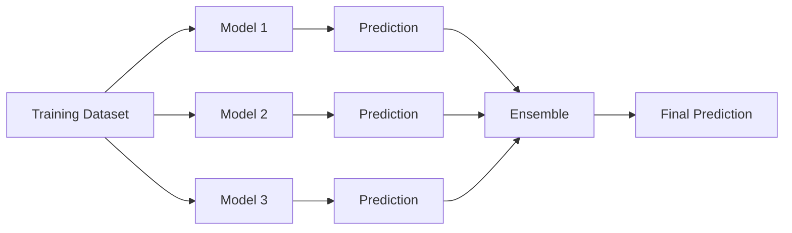

# Ensemble Models in Supervised Machine Learning

> A technical review of ensemble models in supervised Machine Learning, including Bagging, Boosting, Stacking, and widely used algorithms such as AdaBoost, XGBoost, LightGBM, CatBoost, Voting Classifier, and Stacking Classifier.

## Project Overview

Ensemble methods are among the most effective approaches in supervised Machine Learning. Instead of relying on a single predictive model, they combine the outputs of multiple learners to improve predictive accuracy, robustness, stability, and generalization.

This repository presents a structured review of the main ensemble strategies: **Bagging**, **Boosting**, and **Stacking**. It also examines the mechanisms, advantages, and common use cases of widely adopted algorithms, including AdaBoost, Gradient Boosting, XGBoost, LightGBM, CatBoost, Voting Classifier, and Stacking Classifier.

The document emphasizes practical applications in customer analytics, marketing, recommendation systems, demand forecasting, fraud detection, and predictive modeling. Every concept is supported by peer-reviewed scientific literature, seminal research papers, or official technical documentation.

# Introduction

Machine Learning has become one of the most influential fields of Artificial Intelligence, enabling computers to identify patterns, learn from historical data, and make predictions across a wide range of applications. Among the different approaches available, **ensemble models** have emerged as one of the most successful techniques for improving predictive performance in supervised learning tasks.

Rather than relying on a single model, ensemble methods combine the predictions of multiple individual learners to produce a more accurate and reliable final prediction. The underlying principle is that a group of diverse models can often outperform even the best individual model by reducing prediction errors and increasing robustness.

Over the past two decades, ensemble algorithms have consistently achieved state-of-the-art performance in academic competitions and real-world industrial applications. Models such as **Random Forest**, **XGBoost**, **LightGBM**, and **CatBoost** are widely used in domains including finance, healthcare, marketing, fraud detection, recommendation systems, customer analytics, and demand forecasting due to their ability to handle complex datasets while maintaining high predictive accuracy.

This document provides a structured overview of ensemble models in supervised Machine Learning. It explains the fundamental concepts of **Bagging**, **Boosting**, and **Stacking**, analyzes their differences, discusses the bias-variance tradeoff, and describes the mechanisms, advantages, and common applications of the most widely used ensemble algorithms. The objective is to provide both a theoretical foundation and a practical understanding of why ensemble methods have become a cornerstone of modern predictive modeling.

# 1. What is an Ensemble Model?

An **ensemble model** is a Machine Learning technique that combines the predictions of multiple individual models, known as **base learners** or **weak learners**, to produce a single, more accurate prediction. Instead of relying on the performance of a single algorithm, ensemble methods exploit the collective intelligence of several models, reducing prediction errors and improving overall performance.

The main objective of ensemble learning is to increase a model's ability to generalize to unseen data. By combining multiple predictors, ensemble models often achieve higher accuracy, greater robustness, and better stability than individual models. This improvement is possible because different models may capture different patterns within the same dataset, allowing the ensemble to compensate for the weaknesses of each individual learner.

Ensemble methods are particularly effective in supervised Machine Learning tasks such as classification and regression. They are widely applied in business environments where predictive accuracy is critical, including customer churn prediction, fraud detection, recommendation systems, demand forecasting, credit risk assessment, and marketing analytics.

The success of an ensemble depends on two key principles:

- **Accuracy:** each individual model should perform better than random guessing.
- **Diversity:** the models should make different types of errors, allowing the ensemble to correct individual mistakes through combination.

Several strategies exist for combining multiple models. The most common approaches are **Bagging**, **Boosting**, and **Stacking**, each using a different mechanism to generate and aggregate predictions. These strategies form the foundation of many of today's most successful Machine Learning algorithms, including Random Forest, XGBoost, LightGBM, and CatBoost.

# 2. What is the Difference Between Bagging and Boosting?

**Bagging (Bootstrap Aggregating)** and **Boosting** are two of the most widely used ensemble learning techniques. Although both combine multiple models to improve predictive performance, they differ significantly in how models are trained and how their predictions are combined.

### Bagging

Bagging builds multiple independent models by training each one on a different bootstrap sample (random samples with replacement) of the original dataset. Since every model learns independently, their predictions are typically combined through majority voting for classification or averaging for regression.

The primary objective of Bagging is to **reduce variance**, making the model more stable and less prone to overfitting.

**Characteristics**

- Models are trained independently.
- Training occurs in parallel.
- Each model uses a different bootstrap sample.
- Final predictions are aggregated through voting or averaging.
- Particularly effective for high-variance models such as decision trees.

**Example:** Random Forest.

### Boosting

Boosting trains models sequentially rather than independently. Each new model focuses on correcting the errors made by the previous models, gradually improving the overall predictive performance.

Instead of treating all observations equally, Boosting assigns greater importance to previously misclassified or poorly predicted instances, allowing the ensemble to learn progressively more difficult patterns.

The primary objective of Boosting is to **reduce bias** while maintaining good generalization performance.

**Characteristics**

- Models are trained sequentially.
- Each model learns from the errors of the previous one.
- More weight is assigned to difficult observations.
- Predictions are combined using weighted aggregation.
- Often achieves higher predictive accuracy but may require careful tuning to avoid overfitting.

**Examples:** AdaBoost, Gradient Boosting, XGBoost, LightGBM, and CatBoost.

### Comparison

| Feature | Bagging | Boosting |
|----------|----------|-----------|
| Training strategy | Parallel | Sequential |
| Main objective | Reduce variance | Reduce bias |
| Model dependency | Independent | Dependent |
| Data sampling | Bootstrap sampling | Reweighted observations or residual learning |
| Risk of overfitting | Lower | Higher if not properly regularized |
| Typical example | Random Forest | XGBoost |

# 3. What is Stacking?

**Stacking (Stacked Generalization)** is an ensemble learning technique that combines the predictions of multiple different models by introducing an additional model, called the **meta-learner**, responsible for producing the final prediction.

Unlike Bagging and Boosting, which typically combine models of the same family, Stacking allows completely different algorithms to work together. For example, a Decision Tree, Support Vector Machine, Logistic Regression, and Neural Network can all serve as base learners.

The process consists of two stages:

1. Multiple base models are trained using the original dataset.
2. Their predictions become the input features for a meta-model, which learns how to combine them to generate the final prediction.

Because different algorithms capture different characteristics of the data, the meta-learner can exploit their complementary strengths, often achieving better predictive performance than any individual model.

### Advantages

- Combines different Machine Learning algorithms.
- Exploits complementary strengths of multiple models.
- Often achieves higher predictive accuracy.
- Highly flexible and adaptable to different problems.

### Limitations

- More computationally expensive.
- More complex to implement.
- Requires careful validation to avoid data leakage and overfitting.

### Example

A marketing company predicting customer purchases may combine predictions from a Random Forest, XGBoost, and Logistic Regression model. A Logistic Regression meta-model then learns how to combine these predictions to produce a more accurate final estimate.

# 4. Why Do Ensemble Models Generalize Better?

One of the primary goals of Machine Learning is to build models that perform well not only on the training data but also on previously unseen data. This ability is known as **generalization**.

Ensemble models generally achieve better generalization because they reduce prediction errors associated with the **bias-variance tradeoff**.

- **Bias** represents errors caused by overly simplistic assumptions. Models with high bias tend to underfit the data.
- **Variance** represents errors caused by excessive sensitivity to the training data. Models with high variance tend to overfit.

Different ensemble strategies address these problems in different ways.

### Bagging

Bagging primarily reduces **variance** by averaging the predictions of multiple independently trained models. Individual errors tend to cancel each other out, producing a more stable predictor.

### Boosting

Boosting primarily reduces **bias** by sequentially correcting previous mistakes. Each model improves upon the weaknesses of its predecessors, allowing the ensemble to learn increasingly complex relationships.

### Stacking

Stacking improves generalization by combining models with different learning behaviors. Since each algorithm captures different patterns in the data, the meta-learner can exploit their complementary strengths to produce more reliable predictions.

As a result, ensemble methods often outperform individual models in terms of predictive accuracy, robustness, and stability, making them the preferred choice for many real-world supervised Machine Learning applications.

## 5.1 AdaBoost (Adaptive Boosting)

AdaBoost, short for **Adaptive Boosting**, was one of the first successful boosting algorithms and was introduced by Yoav Freund and Robert Schapire in 1997. It builds a strong classifier by sequentially combining multiple weak learners, typically shallow decision trees known as decision stumps.

### Mechanism

AdaBoost trains one weak learner at a time. After each iteration, the algorithm increases the weights of the training instances that were incorrectly classified, forcing the next learner to focus on the most difficult observations. At the end of the training process, each learner contributes to the final prediction according to its accuracy, with better-performing models receiving greater influence.

### Advantages

- Simple and relatively easy to implement.
- Often achieves higher accuracy than a single classifier.
- Reduces prediction bias by progressively correcting previous errors.
- Performs well on clean and moderately sized datasets.
- Can improve weak learners into a strong predictive model.

### Common Use Cases

- Customer churn prediction.
- Email spam detection.
- Credit approval systems.
- Marketing campaign response prediction.
- Binary classification problems with structured data.

## 5.2 Gradient Boosting

Gradient Boosting is a boosting technique that improves predictive performance by sequentially fitting new models to the residual errors made by previous models. Unlike AdaBoost, which adjusts sample weights, Gradient Boosting minimizes a differentiable loss function using gradient descent principles.

### Mechanism

The algorithm begins with an initial prediction. Each subsequent model is trained to predict the residual errors of the current ensemble. By iteratively reducing these errors, the ensemble gradually converges toward a more accurate prediction.

### Advantages

- High predictive accuracy.
- Flexible optimization through different loss functions.
- Applicable to both regression and classification.
- Captures complex nonlinear relationships.
- Provides feature importance estimates.

### Common Use Cases

- Sales forecasting.
- Customer lifetime value prediction.
- Insurance risk assessment.
- Demand forecasting.
- Financial forecasting.

## 5.3 XGBoost (Extreme Gradient Boosting)

XGBoost is an optimized implementation of Gradient Boosting designed for speed, scalability, and predictive performance. Developed by Tianqi Chen and Carlos Guestrin, it has become one of the most successful Machine Learning algorithms for structured tabular data.

### Mechanism

XGBoost extends traditional Gradient Boosting by incorporating regularization techniques, parallel tree construction, efficient handling of missing values, and optimized memory management. These improvements reduce overfitting while significantly accelerating model training.

### Advantages

- Excellent predictive accuracy.
- Fast and scalable training.
- Built-in regularization reduces overfitting.
- Handles missing values automatically.
- Supports parallel processing.
- Widely adopted in Machine Learning competitions.

### Common Use Cases

- Fraud detection.
- Credit scoring.
- Customer churn prediction.
- Recommendation systems.
- Demand forecasting.
- Marketing analytics.